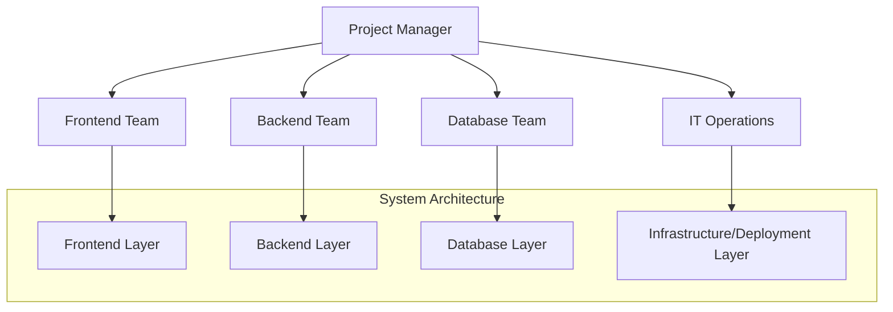
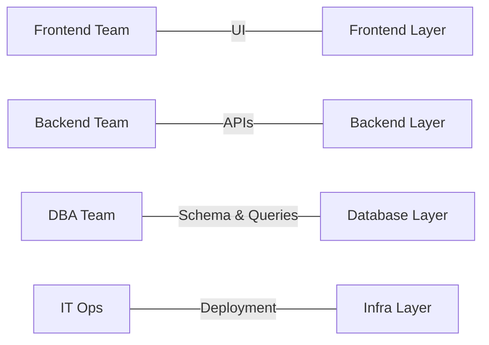
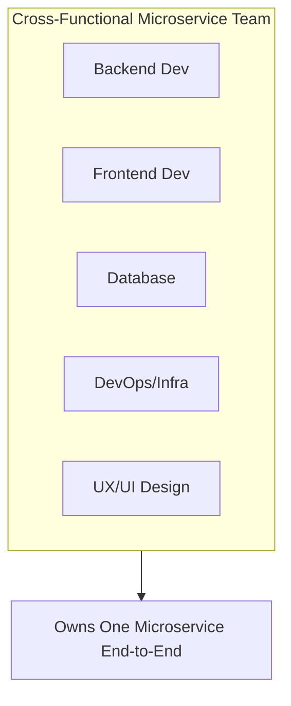
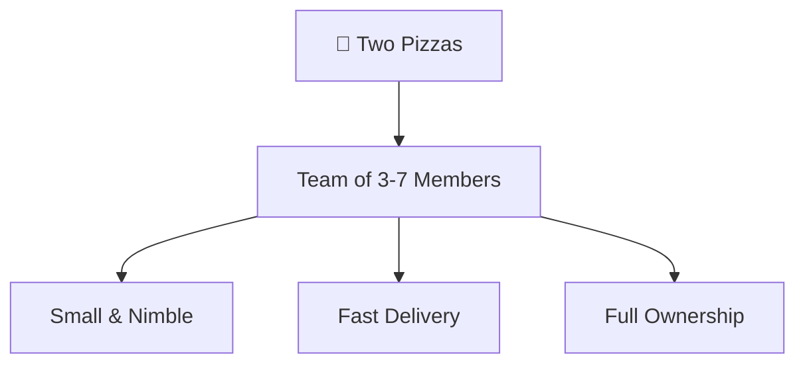
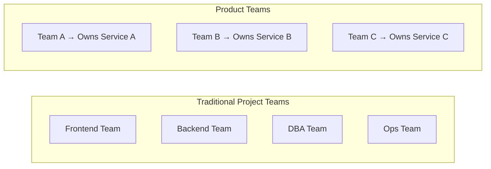

## Microservices and Organization

#### What You Need to Know

So far, we've talked extensively about the architectural and technological aspects of Microservices. By now, you might feel well-equipped to design a robust Microservices architecture - and you might be right.

However, transitioning to Microservices isn't just an architectural or technological journey. It's an organizational transformation that impacts how teams work, communicate, and deliver value.

In this section, we'll explore how Microservices affect your organization and what changes are necessary to fully support this new architectural style.

#### Microservices Require a Different Mindset

Throughout this series, especially in the architecture-focused sections, we've touched on the importance of mindset. And by now, it should be clear: adopting Microservices without shifting your mindset is a recipe for failure.

Traditional organizations, especially those that have operated in a certain way for decades, often struggle with this transition. A company that's been building software the same way for 20 years can't expect to adopt Microservices successfully without changing how it works. Trying to "bolt on" Microservices without adjusting processes, culture, and team structures will almost certainly lead to frustration - and likely failure.

In short: if you're not willing to adapt, there's little point in moving to Microservices.

#### Why Traditional Organizational Structures Fall Short

Microservices thrive in environments where teams are autonomous, cross-functional, and aligned with business capabilities. Traditional, siloed organizational structures - where development, testing, and operations are separate entities - don't align well with the principles of Microservices.

To truly take advantage of what Microservices offer, organizations need to rethink team structures, ownership, communication, and even deployment strategies.

In the next section, we'll dive deeper into the key organizational changes that support a successful Microservices transformation.

## Conway's Law

**No Conversation About Microservices is Complete Without Mentioning Conway's Law**

When discussing microservices architecture within any organization, it's impossible to avoid the impact of **Conway's Law**.

Conway's Law isn't a formal rule or regulation - it's an insightful **observation**, first introduced in 1967 by computer scientist and programmer **Melvin Conway**. Though it dates back decades, I'm always amazed at just how **relevant and accurate** it still is today.

So, what is Conway's Law?

In essence, it states:

> **"Any organization that designs a system will produce a design whose structure mirrors the organization's communication structure."**

Put simply, the architecture of your system will reflect how your teams are structured and how they communicate.

Even though this connection may not seem obvious at first glance, it becomes very clear once we look at how traditional organizations are set up.

### A Traditional Project Organization

Let's consider a common organizational structure for a typical software project. At the top, we have a **Project Manager**, and beneath that, four specialized teams:

1.  **IT Operations Team** -- responsible for infrastructure tasks such as managing virtual machines, deployments, source control, and more.
2.  **Backend Development Team** -- working with server-side technologies like Java, .NET, Node.js, etc.
3.  **Frontend Development Team** -- using frameworks such as React, Angular, or Vue.js to build user interfaces.
4.  **Database Administrators (DBAs)** -- managing the database schema, queries, backups, and performance.

This org chart leads to a system design that mirrors the team boundaries:

-   A separate **frontend layer**, handled by frontend developers.
-   A **backend layer**, developed independently by the backend team.
-   A distinct **database layer**, managed solely by DBAs.
-   And a **deployment/infrastructure layer**, maintained by IT operations.

Each team is responsible for its own component, and effective collaboration is required across these silos. For example:

-   Frontend developers must coordinate with backend teams to ensure their API integrations are working correctly.
-   Backend developers need to align with DBAs to confirm database schemas haven't changed unexpectedly.

### Conway's Law in Action

What you end up with is a **system architecture that mirrors the organization's structure** - exactly what Conway's Law predicts.

The organizational chart and the system design are often nearly identical. This isn't a coincidence - it's a direct consequence of how communication flows within the company.

You might even find color-coded value streams or components in your system that match the team divisions. That's Conway's Law in full effect.

### So, What's the Problem?

While this setup might work fine in traditional monolithic applications, it becomes a major problem when moving to **microservices**.

And here's why: Microservices demand **cross-functional collaboration**, **autonomy**, and **tight integration** between features - not silos.

In the next section, we'll explore **why Conway's Law presents challenges for microservices** and how modern teams must adapt their structure to truly unlock the benefits of a microservices architecture.

## The Problem with Traditional Team

### What's the Problem with Traditional Teams?

As we saw in the previous section, traditional project teams are typically organized around **technology layers**. You have:

-   A **Frontend Team**
-   A **Backend Team**
-   A **Database (DB) Team**
-   An **IT/Operations Team**

Each team owns a horizontal slice of the architecture.

But here's the problem: **this structure directly conflicts with one of the core principles of microservices** - specifically, **attribute #3: "Products, not Projects."**

Or, in the words of Werner Vogels, CTO of Amazon Web Services:

> **"You build it, you run it."**

In a traditional setup, **no single team owns the entire product**. The frontend team builds the UI, the backend team writes the APIs, the DBAs handle the data layer, and the IT team manages deployments. Each group works in isolation, focused solely on their part of the system.

As a result:

-   There's **no holistic view** of the product.
-   **Ownership is fragmented**, so no one feels fully responsible for what happens after their piece is delivered.
-   **Customer outcomes and feedback loops are ignored** - because it's seen as a *project*, not a *product*.

Each team's mindset becomes:\
*"We built our part. It's someone else's problem now."*

This is exactly the **opposite** of what we want in a microservices world, where **cross-functional teams** own **the full lifecycle** of a **product** or **service** - from development to deployment to support.

By slicing teams horizontally, we've unintentionally built a **project-centric** organization.

But microservices thrive in a **product-centric** model, where each team owns a vertical slice of functionality, including UI, backend, data, and operations.

## The Ideal Team

### What Does the *Ideal* Team Look Like in a Microservices World?

Now that we've identified the problems with the traditional team structure, the natural next question is:

**What should the ideal team look like?**\
How should it function?\
What should it own?\
And how big should it be?

### A Cross-Functional Team That Owns the Product

In a microservices architecture, the ideal team is one that takes **full ownership of a service** - end-to-end. That means responsibility for:

-   **Backend development**
-   **Frontend/UI**
-   **Database**
-   **Deployment and operations**
-   Even **UX/UI design** if applicable

In short, the team should have everything it needs to **deliver and maintain a complete product or service**, independently.

This kind of **cross-functional team** develops **team spirit**, builds **ownership**, and most importantly - focuses on the **product as a whole**, not just their layer of the tech stack.

By consolidating responsibility within a single, autonomous team, we eliminate the communication overhead between siloed groups, speed up delivery, and drastically improve accountability.

This mindset shift - from "my part of the project" to "our product" - is **key** in microservices success.

### So, What's the Ideal Team Size?

This brings us to another important question:\
**How big should a microservices team be?**

There are many opinions, but one of the most quoted (and amusing) benchmarks comes from Amazon founder **Jeff Bezos**:

> **"If a team can't be fed with two pizzas, it's too big."**

While not exactly scientific, the "two-pizza rule" points us toward a truth:\
**Smaller teams are more effective.**

In practice, that usually means:

-   **3 to 7 team members**
-   Varies depending on skill sets, product complexity, and responsibilities
-   Enough people to cover all key roles, but not so many that coordination becomes a burden

Also worth noting:\
**Pizza isn't mandatory - although always welcome. 🍕**

### Summary

In a microservices system, your ideal team is:

-   **Cross-functional** -- includes all skills needed to deliver a service
-   **Product-focused** -- takes end-to-end ownership
-   **Autonomous** -- minimal dependencies on other teams
-   **Small and nimble** -- typically 3 to 7 members

This structure aligns perfectly with microservices principles and helps teams move faster, own outcomes, and deliver better software.

## Changing Mindset

### Driving the Microservices Mindset Shift in Your Organization

One of the **biggest challenges organizations face when adopting microservices** isn't technical - it's **changing the mindset**.

As we've discussed throughout this course, microservices demand a **fundamentally different approach** to software design and development:

-   Emphasis on **loose coupling**
-   Designing **small, autonomous services**
-   Thinking in terms of **products, not projects**
-   Prioritizing **ownership, scalability, and agility**

While the benefits are clear, **many traditional organizations struggle with the transition**. They're often unsure where to start or how to manage the cultural and structural shifts required.

And that's where **you**, the **architect**, play a crucial role.

### How Can You Help Drive the Change?

As someone with a deeper understanding of microservices, you're in a perfect position to **lead the transformation**. Here are three practical ways you can make a real impact:

#### 1\. **Start with Training  -  and Do a Lot of It**

You've already learned a lot about microservices. Now it's time to **teach others**.

-   Conduct **internal workshops** or **tech talks**.
-   Share **success stories** from companies like **Netflix**, **Amazon**, and **Spotify** - showing what's possible when microservices are done right.
-   Explain the **core principles** in simple terms: loose coupling, high cohesion, team autonomy, and continuous delivery.

Education builds confidence - and **confidence is the foundation** for change.

#### 2\. **Run a Proof of Concept (POC)**

A **POC (Proof of Concept)** is one of the most effective ways to introduce microservices without overwhelming the team or organization.

-   Choose a **small, focused system** or feature.
-   Design and build it using microservices principles.
-   Involve developers directly - **build it with them**, not just for them.

This approach delivers a **quick win**, and quick wins are powerful:

-   They build **momentum**
-   Create **internal success stories**
-   Help **demystify the process** for skeptical stakeholders

POCs also allow teams to learn through experience - which is the best teacher of all.

#### 3\. **Be There During Design and Development**

When development begins, you'll likely be the **most experienced person on the team when it comes to microservices**. Use that expertise to **guide the team hands-on**.

-   **Participate in design discussions**
-   **Review architectures and service boundaries**
-   **Answer questions and unblock developers quickly**

Most importantly: make sure the team **knows you've got their back**.\
If developers feel supported and empowered - not judged - they'll take more ownership and move with confidence.

If they know **you won't let them fail**, the chances of success rise dramatically.

### Final Thoughts

Adopting microservices is as much about **people and culture** as it is about code and infrastructure. It's a journey, not a one-time change.

As an architect, your role is more than just designing services - it's about **leading the mindset shift**, **enabling others**, and **removing friction** from the transition.

Train. Build. Support.\
That's how transformation happens - one team, one service, and one success at a time.